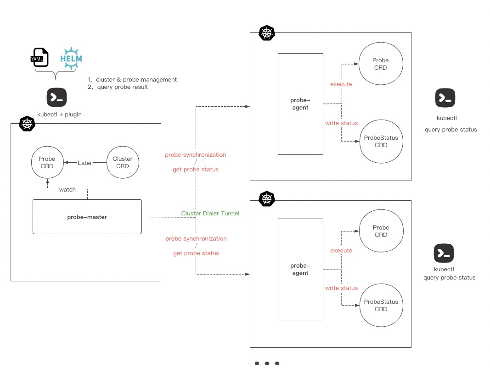

English | [简体中文](./README_CN.md)

# KubeProber

##Demo


## What is KubeProber?
KubeProber is a diagnostic tool designed for large-scale Kubernetes clusters. It is used to perform diagnostic items in the kubernetes cluster to prove that the functions of the cluster are normal,  KubeProber has the following characteristics:

* **Large-scale clusters support** Supports multi-cluster management, supports configuring the relationship between clusters and diagnostic items on the management side and viewing the diagnostic results of all clusters in a unified manner;
* **Cloud Native** The core logic is implemented by [operator](https://kubernetes.io/docs/concepts/extend-kubernetes/operator/), providing complete Kubernetes API compatibility;
* **Extensible** Support user-defined diagnostic items

Different from the monitoring system, KubeProber proves the functions of the cluster are normal from the perspective of diagnostic. Monitoring is a forward link and cannot cover all scenarios in the system. The monitoring data of each environment in the system is normal and cannot prove the system is 100% normal, so a tool is needed to prove the availability of the system from the reverse, and fundamentally to discover unavailable points in the cluster before users, such as:
* Whether all nodes in the set can be scheduled, whether there are special taints, etc;
* Whether the pod can be normally created, destroyed, and verified the entire link from kubernetes, kubelet to docker;
* Create a service and test unicom to verify whether the kube-proxy link is normal;
* Resolve an internal or external domain name to verify whether CoreDNS is working properly;
* Visit an ingress domain name to verify whether the ingress component in the cluster is working properly;
* Create and delete a namespace to verify whether the related webhook is working properly;
* Perform operations such as put/get/delete on Etcd to verify whether Etcd is running normally;
* Verify the normal operation of MySQL through the operation of mysql-client;
* Simulate users to log in and operate the business system to verify whether the main business process is frequent;
* Check whether the certificates of each environment have expired;
* Expiration check of cloud resources;
* ... more!

## Architecture


### probe-master

The operator running on the management cluster. This operator maintains two CRDs, one is Cluster, which is used to manage the managed cluster, and the other is Probe, which is used to manage the built-in and user-written diagnostic items, probe-master Through watch these two CRDs, the latest diagnostic configuration is pushed to the managed cluster, and probe-master provides an interface for viewing the diagnosis results of the managed cluster.

### probe-agent

The operator running on the managed cluster. This operator maintains two CRDs. One is a Probe that is exactly the same as the probe-master. The probe-agent executes the cluster’s diagnostic items according to the definition of the probe. The other is ProbeStatus for Record the diagnosis results of each Probe. Users can view the diagnosis results of the cluster through kubectl get probestatus in the managed cluster.
## Getting started
### Installation
Both the master and agent of kubeprober run as controllers in kubernetes. Before installation, make sure that you have deployed the kubernetes cluster and can access it using kubectl.
#### Deploy probe-master：
The operation of WebHook needs to verify the certificate, and you need to deploy the cert-manager service first:
```
kubectl apply -f https://github.com/jetstack/cert-manager/releases/download/v1.3.1/cert-manager.yaml
```
install probe-master:
```
APP=probe-master make deploy
```
#### Deploy probe-agent：

Before deploying the agent, make sure that you have created a cluster in the master side:
```
kubectl apply -f config/samples/kubeprobe_v1_cluster.yaml
kubectl get cluster
```
Modify the configmap configuration after creating the cluster:
```
vim config/manager-probe-agent/manager.yaml

---
apiVersion: v1
kind: ConfigMap
metadata:
  name: probeagent
  namespace: system
data:
  probe-conf.yaml: |
    probe_master_addr: http://kubeprober-probe-master.kubeprober.svc.cluster.local:8088
    cluster_name: moon
    secret_key: 2f5079a5-425c-4fb7-8518-562e1685c9b4
```

If only probe-agent need (e.g debug/developing or just running probe cases in one k8s cluster), following configurations needed, 
and probe-agent will stop communication with master.

```
vim config/manager-probe-agent/manager.yaml

---
apiVersion: v1
kind: ConfigMap
metadata:
  name: probeagent
  namespace: system
data:
  probe-conf.yaml: |
    # default disabled, if enabled, probe-agent will stop communication with master
    agent_debug: true
    # default 1, if more verbose info needed, increase it
    debug_level: 1
```

install probe-agent
```
APP=probe-agent make deploy
```

### To start developing kubeprober
You can run and build probe-master and probe-agent locally. please make sure that ~/.kube/config can access the kubernetes cluster.
#### install crd && webhook resources
```
make dev
```
#### run probe-master
```
APP=probe-master make run
```
#### run probe-tunnel
Before run probe-agent, a cluster crd resource should be created, same as section [Deploy probe-agent]
```
# export env get from the create cluster crd
export PROBE_MASTER_ADDR="http://127.0.0.1:8088"
export CLUSTER_NAME="moon"
export SECRET_KEY="a944499f-97f3-4986-89fa-bc7dfc7e009a" 

# run probe-agent
APP=probe-tunnel make run
```
#### run probe-agent
```
APP=probe-agent make run
```
probe-agent parameters precedence order and format
```
# precedence order and format, each item takes precedence over the item below it, (e.g --cluster-name)
flag       --cluster-name
env          CLUSTER_NAME
config       cluster_name
default
```

#### build binary file
```
APP=probe-master make build
APP=probe-agent make build
```
#### build image
```
# build with default version: latest
# output image format: kubeprober/probe-master:latest
APP=probe-master make docker-build

# build with custom version: v0.0.1
# output image format: kubeprober/probe-master:v0.0.1
APP=probe-master V=v0.0.1 make docker-build

# build with default version: latest
APP=probe-agent make docker-build

# push with default version: latest
APP=probe-agent make docker-push

# build & push
APP=probe-agent make docker-build-push
```
### Write your prober
[custom probes](./probers/README.md)

## Contributing
Contributions are always welcomed. Please refer to [Contributing to KubeProber](CONTRIBUTING.md) for details.

## Contact Us
If you have any questions, please feel free to contact us.

- Email: erda@terminus.io
- Zhihu：[Erda技术团队](https://www.zhihu.com/people/erda-project) (A Chinese knowledge community, similar to Quora.)
- WeChat Official Account:

    

## License

KubeProber is under the Apache 2.0 license. See the [LICENSE](LICENSE) file for details.
